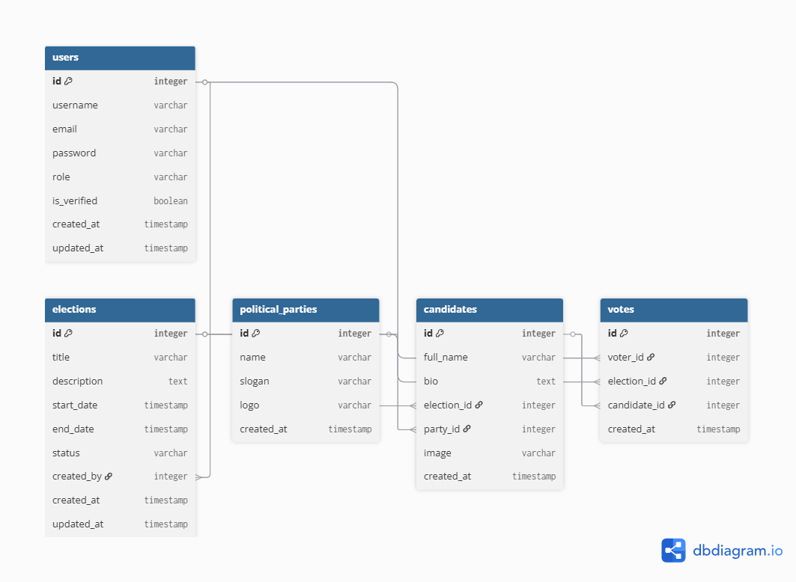

# SecureVote

A secure, scalable, and production-ready electronic voting platform built using Django REST Framework and React.

SecureVote enables organizations, institutions, and election administrators to create elections, manage candidates, register voters, cast votes securely, and view election results in real time.

The system follows modern software engineering principles including clean architecture, API-first development, containerization, automated testing, CI/CD readiness, and cloud deployment preparation.


# Project Overview

SecureVote is designed to address common challenges in electronic voting systems including:

- Voter authentication
- Election integrity
- Duplicate vote prevention
- Role-based access control
- Real-time vote tallying
- Secure API communication
- Auditability
- Scalability

The platform consists of:

- Django REST Framework Backend
- React Frontend
- PostgreSQL Database
- Redis Cache & Message Broker
- Celery Background Tasks
- Dockerized Infrastructure
- Nginx Reverse Proxy
- CI/CD Ready Architecture


# Key Features

## Authentication & Authorization

- JWT Authentication
- Custom User Model
- Role-Based Access Control
- Admin Permissions
- Voter Permissions

## Election Management

- Create Elections
- Update Elections
- Activate Elections
- Close Elections
- Election Scheduling

## Candidate Management

- Register Candidates
- Candidate Profiles
- Candidate-Election Mapping

## Voting

- One Voter One Vote Enforcement
- Duplicate Vote Prevention
- Vote Validation
- Election Status Verification

## Results Management

- Real-Time Vote Counting
- Election Analytics
- Winner Determination
- Public Result Viewing

## System Security

- Secure Authentication
- Environment Variable Protection
- Permission Enforcement
- Database Constraints
- API Validation
- Containerized Deployment


# Technology Stack

## Backend

- Python 3.11
- Django 5
- Django REST Framework
- PostgreSQL
- Redis
- Celery

## Frontend

- React
- JavaScript
- Axios
- React Router

## Infrastructure

- Docker
- Docker Compose
- Nginx
- Gunicorn

## Testing

- Pytest
- Factory Boy
- Coverage

## Documentation

- Swagger/OpenAPI
- drf-spectacular

## DevOps

- GitHub Actions
- CI/CD Pipelines


# System Architecture


# Entity Relationship Diagram (ERD)




# Project Structure

```text
secureVote/
│
├── apps/
│   ├── users/
│   ├── elections/
│   ├── votes/
│   └── common/
│
├── config/
│   ├── settings/
│   ├── urls.py
│   ├── celery.py
│   └── wsgi.py
│
├── tests/
│   ├── factories/
│   └── integration/
│
├── docs/
│   ├── diagrams/
│   
│
├── Dockerfile
├── docker-compose.yml
├── requirements.txt
└── README.md
```


# Installation

## Clone Repository

```bash
git clone https://github.com/yourusername/securevote.git

cd securevote/backend
```

## Create Virtual Environment

```bash
python -m venv venv
```

### Windows

```bash
venv\Scripts\activate
```

### Linux

```bash
source venv/bin/activate
```

## Install Dependencies

```bash
pip install -r requirements.txt
```


# Database Setup

Run migrations:

```bash
python manage.py migrate
```

Create superuser:

```bash
python manage.py createsuperuser
```

Start server:

```bash
python manage.py runserver
```

---

# Docker Setup

Build containers:

```bash
docker compose build
```

Run containers:

```bash
docker compose up
```

Run in detached mode:

```bash
docker compose up -d
```

Stop containers:

```bash
docker compose down
```

---

# Celery Setup

Start worker:

```bash
celery -A config worker --loglevel=info
```

Start scheduler:

```bash
celery -A config beat --loglevel=info
```

---

# Running Tests

Run all tests:

```bash
pytest
```

Run coverage:

```bash
pytest --cov
```

Generate coverage report:

```bash
coverage html
```

---

# API Documentation

Swagger Documentation:

```text
http://localhost:8000/api/schema/swagger-ui/
```

Redoc Documentation:

```text
http://localhost:8000/api/schema/redoc/
```

OpenAPI Schema:

```text
http://localhost:8000/api/schema/
```


# API Endpoints

## Authentication

| Method | Endpoint |
|----------|------------|
| POST | /api/auth/register/ |
| POST | /api/auth/login/ |
| POST | /api/auth/token/refresh/ |

## Elections

| Method | Endpoint |
|----------|------------|
| GET | /api/elections/ |
| POST | /api/elections/ |
| GET | /api/elections/{id}/ |
| PATCH | /api/elections/{id}/ |

## Candidates

| Method | Endpoint |
|----------|------------|
| GET | /api/candidates/ |
| POST | /api/candidates/ |

## Voting

| Method | Endpoint |
|----------|------------|
| POST | /api/votes/ |
| GET | /api/results/ |


# Security Features

- JWT Authentication
- Role-Based Permissions
- Secure Environment Variables
- PostgreSQL Constraints
- Input Validation
- Docker Isolation
- API Rate Limiting 
- HTTPS Enforcement (Production)


# Deployment Architecture

Production deployment includes:

- React Frontend
- Django API
- Gunicorn
- Nginx Reverse Proxy
- PostgreSQL
- Redis
- Celery Workers
- GitHub Actions CI/CD
- AWS Deployment Pipeline


# Future Enhancements

- Email Notifications
- SMS Verification
- Multi-Factor Authentication
- Blockchain Audit Trail
- Election Analytics Dashboard
- Kubernetes Deployment
- AWS ECS Deployment
- Prometheus Monitoring
- Grafana Dashboards

# License

This project is licensed under the MIT License.
